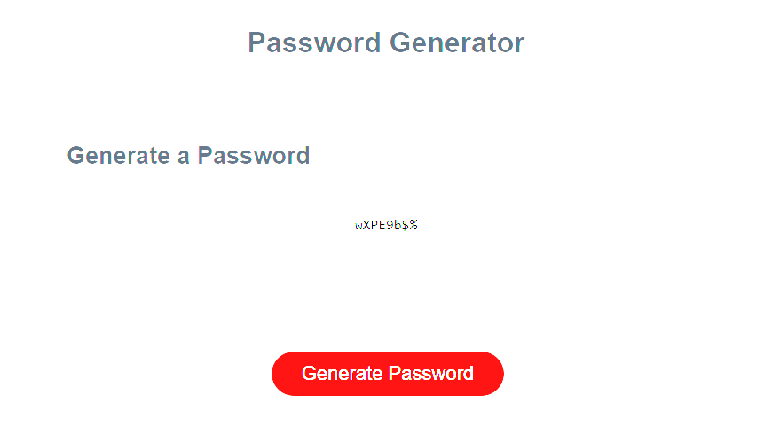

# Password Generator

## Description

- My motivation for this project was to create a password generator with multiple different variables included to create secure passwords.
- I built this project to put my knowledge of JavaScript to the test to create a functional and useful application.
- This code creates unique passwords based on several user-selected variables.
- Composing this password generator, I learned many things about JavaScript, such as how to utilize 'if' statements, implement window prompts, returning a list, and 'for' statements.

## Github & Deployed Site
- [Github](https://github.com/Celyph)
- [Deployed Site](https://celyph.github.io/password-generator/)

## Usage

## Credits

I used the ReadMe guide from [https://coding-boot-camp.github.io/full-stack/github/professional-readme-guide](https://coding-boot-camp.github.io/full-stack/github/professional-readme-guide).